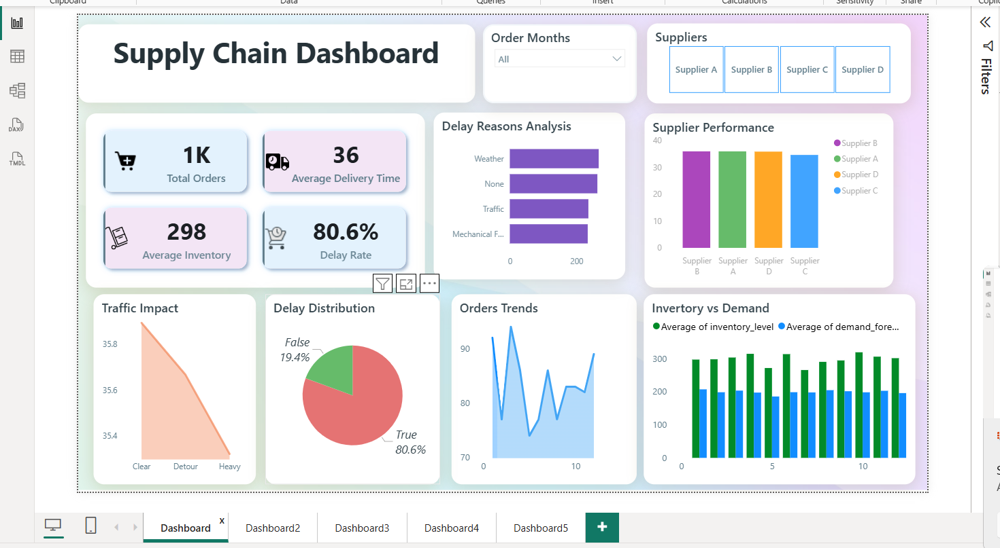
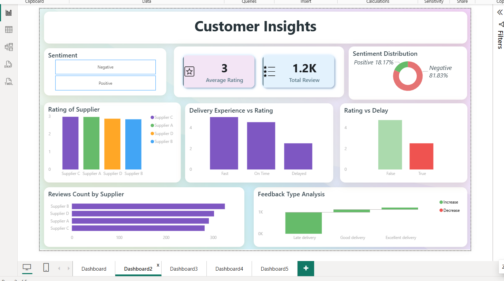
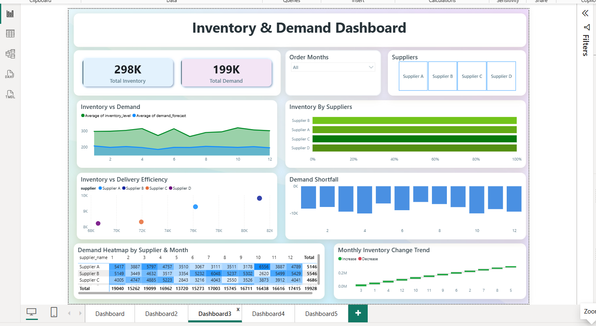
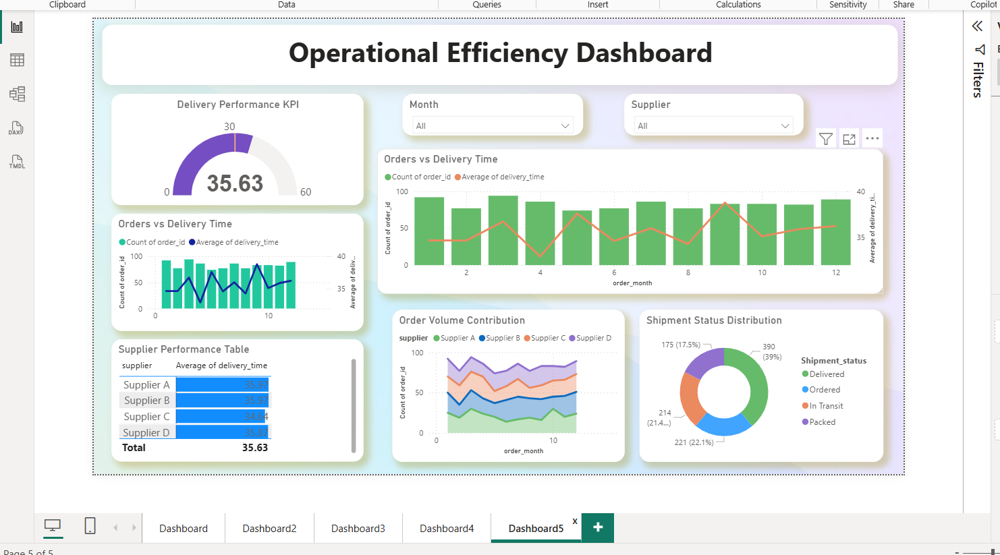
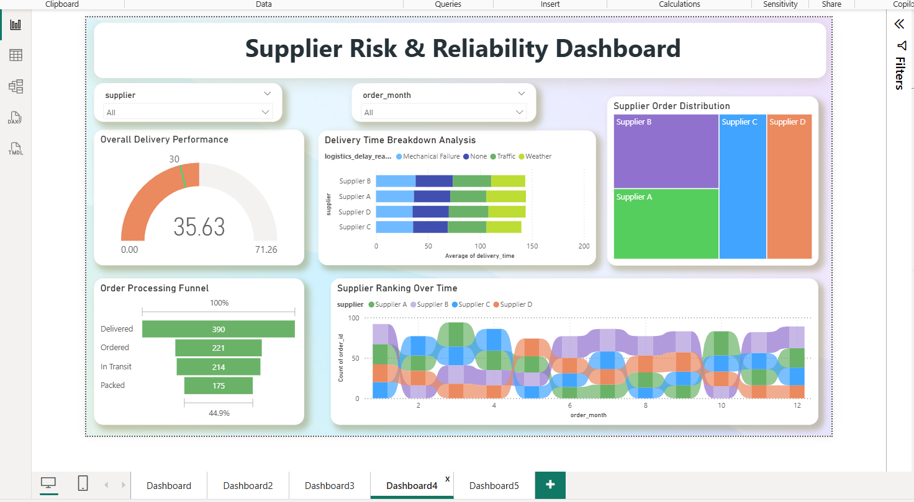

# Supply Chain Analytics & Visualization Dashboard

### 📥 Download Dashboard File: [Click Here - Supply chain analysis.pbix](Supply%20chain%20analysis.pbix)

## 📌 Project Overview
This is an end-to-end Supply Chain Analytics project built in Power BI. The project analyzes 199K+ orders to identify delivery delays, inventory issues, and supplier performance to improve business decisions. Made as part of BCA curriculum.

## 🔄 Workflow
1.  **Data Source:** Data collected from Microsoft Excel files.
2.  **Data Cleaning:** Cleaned data in Excel & Power Query (removed nulls, duplicates).
3.  **Data Modeling & DAX:** Created relationships and DAX measures like Delay Rate (80.6%), Avg Delivery Time.
4.  **Visualization:** Built 5 interactive dashboards.

## 📊 Dashboards

### 1. Main Supply Chain Dashboard

### 2. Customer Insights Dashboard

### 3. Inventory & Demand Dashboard

### 4. Supplier Risk & Reliability Dashboard

### 5. Operational Efficiency Dashboard

## 🎯 Key Insights & Findings
- **High Delay Rate:** 80.6% of orders are delayed with an average delay of 36 days.
- **Customer Impact:** Due to delays, 81.83% of customer feedback is negative, affecting the overall rating (2.64).
- **Low Supplier Performance:** Overall supplier performance score is only 35.63, indicating poor reliability.
- **Inventory Shortage:** 46% of products face inventory shortage, causing late shipments.
- **Business Solution:** Improving supplier reliability and inventory management can directly increase customer satisfaction and operational efficiency.

## 🛠️ Technologies Used
- Power BI, Power Query, DAX, MS Excel, Data Modeling
- Analytical Thinking, Business Analysis, Data Visualization

## 👩‍💻 Author
Tanisha Thapa - BCA Student | Aspiring Data Analyst
